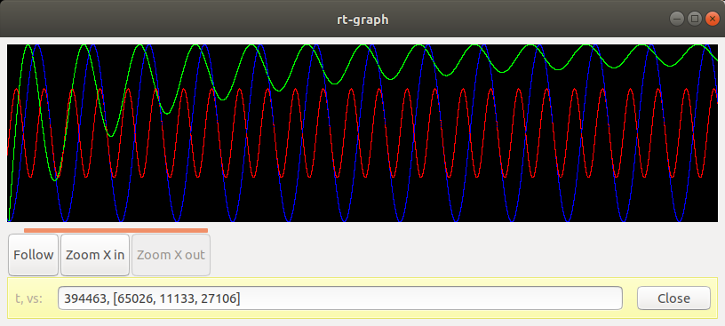

# rt-graph

A real-time graphing experiment written in Rust.



Many other graphing tools do not efficiently update the display when
new data is added, for example redrawing the whole screen when only a
few pixels of new data are added.

This crate tries to do the minimum incremental work required to update
the graph when new data is added: draw the few pixels of new data, and
scroll the graph with efficient large copies, which can and should be
accelerated by GPU hardware.

As a result of this design rt-graph easily copes with 30k new points
per second, at 60 FPS, using just 3% CPU (tested on a Lenovo T460
laptop from 2016 with 2.4 GHz Intel Core i5-6300U, running Ubuntu
18.04.5).

Source repository: <https://github.com/fluffysquirrels/rt-graph-rs/>
(issues and pull requests are welcome!)

Documentation: <https://docs.rs/rt-graph>

Crate: <https://crates.io/crates/rt-graph>

## Prerequisites

First install GTK 3 dependencies.

On OS X with brew try: `brew install gtk+3`

On Ubuntu try: `sudo apt-get install libgtk-3-dev`

## Run an example

Clone the source repository from
<https://github.com/fluffysquirrels/rt-graph-rs/> then try to run an
example with some simulated data:

```
cargo run --package "example-simple" --release
```

You can scroll back and forth with the scrollbar under the graph, or
go back to following the latest data by clicking the "Follow" button,
and zoom in and out with the buttons. Click on the graph to show an
information bar underneath it with the raw data where you clicked.

## Build your own application

To use your own data implement the `DataSource` trait and pass an
instance of your struct to the `ConfigBuilder::data_source()` method
while building a `Graph` or `GraphWithControls`.

`rt-graph` uses GTK (via the [gtk-rs](https://gtk-rs.org/) Rust
bindings) for its UI and is designed to be embedded into any
`gtk::Container` in your application.

## Helpful links

GTK 3 documentation:  <https://developer.gnome.org/gtk3/stable/index.html>

gtk-rs (Rust GTK bindings) documentation: <https://gtk-rs.org/docs-src/>

## Changelog

### 0.3.0 (UNRELEASED)

* Flip y axis so increasing values are higher on the screen.
* Make `Store` private.
* Add more per-item documentation.

### 0.2.0

* Refactor out Graph, GraphWithControls, so consumers can write their own controls.

### 0.1.1

* Add more content to the README, including a screenshot.
